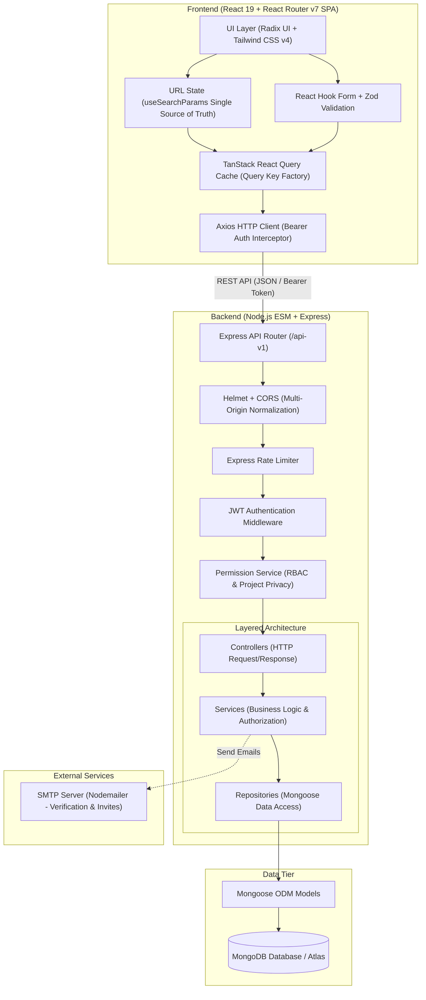

# TaskHub — Collaborative Project & Workspace Manager

[](https://nodejs.org/)
[](https://react.dev/)
[](https://reactrouter.com/)
[](https://tailwindcss.com/)
[](https://tanstack.com/query)
[](https://www.mongodb.com/)
[](https://opensource.org/licenses/ISC)

TaskHub is a modern, high-performance, full-stack collaborative project management platform designed for teams, agencies, and cross-functional organizations. It provides multi-tenant workspace isolation, granular role-based access control (RBAC), project privacy barriers, interactive task boards and lists, threaded discussions, subtasks, audit trails, and data visualization dashboards.

---

## Table of Contents

- [Overview](#overview)
- [Key Features](#key-features)
- [Architecture](#architecture)
- [Role-Based Access Control (RBAC)](#role-based-access-control-rbac)
- [Tech Stack](#tech-stack)
- [Project Structure](#project-structure)
- [API Reference](#api-reference)
- [Getting Started](#getting-started)
  - [Prerequisites](#prerequisites)
  - [Backend Setup](#backend-setup)
  - [Frontend Setup](#frontend-setup)
- [Running Tests & Quality Assurance](#running-tests--quality-assurance)
- [Production Deployment](#production-deployment)
  - [Deploying Backend to Render](#deploying-backend-to-render)
  - [Deploying Frontend to Vercel](#deploying-frontend-to-vercel)
- [License](#license)

---

## Overview

TaskHub was built to address the challenges of team collaboration, task visibility, and workspace organization without unnecessary complexity. It features a responsive dark-mode interface built on React 19, paired with a resilient, layered Node.js REST API.

Key design principles:
- **Clean Layered Architecture**: Strict separation of concerns using the **Controller-Service-Repository** pattern. Services orchestrate business logic; repositories handle data queries; controllers handle HTTP requests and responses.
- **Strict Data Privacy**: Granular project-level and workspace-level permission gates ensure users only read and mutate resources they are authorized to access.
- **Unidirectional State Flow**: The browser URL acts as the single source of truth for all filters, sorting, and search states with debounced input, clean history management, and zero re-render loops.
- **Smooth User Experience**: Zero layout-shift skeleton loading, optimistic cache updates via TanStack Query, and instant workspace context switching.

---

## Key Features

- **Workspaces & Collaboration**:
  - Multi-tenant workspace isolation with customized workspace branding (colors, names).
  - Secure tokenized email invitations with JWT expiration and acceptance workflows.
  - Workspace role management (`Owner`, `Admin`, `Member`, `Viewer`) and ownership transfer.
- **Project Tracking & Privacy**:
  - Projects scoped to workspaces with configurable timelines, priorities, statuses, and tags.
  - Explicit project membership: workspace owners and admins maintain administrative oversight, while regular members only see projects they belong to or created.
- **Task Management**:
  - Create and manage tasks with statuses (`To Do`, `In Progress`, `Done`), priorities (`Low`, `Medium`, `High`), due dates, assignees, and watchers.
  - Switch between interactive **List View** and visual **Board/Grid View**.
  - URL-synchronized search with 300ms debounce, status filtering, and chronological sorting.
- **Subtasks & Comments**:
  - Break tasks into actionable subtasks with toggleable completion states.
  - Threaded discussion comments with relative timestamps and author avatars.
- **Audit Trails & Activity Logs**:
  - Automatic audit logging for every major action (project creation, task updates, member invitations, description edits, attachment uploads).
- **Interactive Dashboards**:
  - Real-time productivity metrics and charts powered by Recharts (Task Trends, Project Status breakdown, Priority distribution, Workspace completion volume).
- **Secure Authentication**:
  - Email and password authentication with verification tokens via Nodemailer.
  - Secure password reset flow, bcrypt hashing, and JWT authorization headers.

---

## Architecture

TaskHub follows a modern, decoupled client-server architecture:



### Architecture Highlights

1. **Frontend Architecture**:
   - **React 19 & React Router v7** in SPA mode (`ssr: false`).
   - **TanStack Query (v5)** with centralized query key factories (`queryKeys.*`) for predictable cache invalidation and background refetching.
   - **URL as Single Source of Truth**: Search query, sort order, and status filters are derived directly from `useSearchParams`, supporting browser history (Back/Forward) and page reload state retention without re-render ping-pong loops.
   - **Tailwind CSS v4 & Radix UI**: Fully custom accessible component system with zero third-party UI library bloat.

2. **Backend Architecture**:
   - **Layered Service-Repository Pattern**: Services never access MongoDB models directly; all database operations go through dedicated repositories (`projectRepository`, `taskRepository`, `workspaceRepository`, `userRepository`, `verificationRepository`).
   - **Transactional Integrity**: Mongoose sessions are passed across repositories during multi-document operations (e.g. account deletion cascading across workspaces, projects, tasks, and invitations).
   - **Permission Boundary**: Centralized `PermissionService` enforces workspace role hierarchies and project privacy boundaries.

---

## Role-Based Access Control (RBAC)

TaskHub implements a two-tier permission system: **Workspace Roles** and **Project Membership**.

| Permission / Action | Workspace Owner | Workspace Admin | Project Member | Workspace Viewer |
| :--- | :---: | :---: | :---: | :---: |
| **Workspace Settings & Deletion** | Yes | No | No | No |
| **Manage Workspace Members & Invites** | Yes | Yes | No | No |
| **Create Projects & Tasks** | Yes | Yes | Yes | No |
| **View Any Workspace Project** | Yes | Yes | Only if assigned | No |
| **View Project Tasks, Comments, Activity** | Yes | Yes | Only if in project | Only if in project (read-only) |
| **Edit / Delete Projects** | Yes | Yes | No | No |
| **Manage Tasks (Create, Edit, Delete)** | Yes | Yes | Yes | No |
| **Add Comments & Toggle Subtasks** | Yes | Yes | Yes | No |

---

## Tech Stack

### Frontend
- **Framework**: React 19, React Router v7 (SPA Mode)
- **State & Data Fetching**: TanStack React Query v5, Axios
- **Styling**: Tailwind CSS v4, Radix UI Primitives, Lucide Icons, tw-animate-css
- **Forms & Validation**: React Hook Form, Zod
- **Visualizations**: Recharts
- **Testing & Tools**: Vitest, TypeScript 5.4, Vite 7, ESLint 9

### Backend
- **Runtime**: Node.js v20+ (ES Modules)
- **Framework**: Express 4
- **Database**: MongoDB with Mongoose 9
- **Security**: Helmet, CORS, Express Rate Limit, bcrypt, JSON Web Tokens (JWT)
- **Validation**: Zod, zod-express-middleware
- **Email Delivery**: Nodemailer (SMTP)
- **Logging & Monitoring**: Winston, Morgan
- **Testing**: Node.js Native Test Runner (`node:test`, `node:assert`)

---

## Project Structure

```text
project-manager/
├── render.yaml                   # Render Blueprint specification for backend deployment
├── README.md                     # Project documentation
├── backend/                      # Node.js Express REST API
│   ├── index.js                  # Application entry point & server setup
│   ├── package.json              # Backend dependencies and scripts
│   ├── src/
│   │   ├── config/               # Database connection (connectDB) & validated env vars
│   │   ├── controllers/          # HTTP request handlers (auth, workspace, project, task, user)
│   │   ├── middleware/           # Auth guard, permission assertions, rate limiter, error handling
│   │   ├── models/               # Mongoose schemas (User, Workspace, Project, Task, Activity, etc.)
│   │   ├── repositories/         # Data access layer (project, task, workspace, user, verification)
│   │   ├── routes/               # Express route endpoints (/api-v1)
│   │   ├── services/             # Business logic & authorization services
│   │   └── utils/                # Logger (Winston), email templates, token generators
│   └── tests/                    # Integration & unit test suites (73 tests)
└── frontend/                     # React 19 Single Page Application
    ├── package.json              # Frontend dependencies and scripts
    ├── react-router.config.ts    # React Router v7 configuration (SPA mode)
    ├── vite.config.ts            # Vite build setup with chunk splitting
    ├── vercel.json               # Vercel deployment rewrites for SPA routing
    └── app/
        ├── components/           # UI components, layout, dashboard widgets, modal dialogs
        ├── hooks/                # React Query custom hooks (useWorkspace, useTask, useProject)
        ├── lib/                  # Fetch utilities (Axios), centralized query keys, schemas, tests
        ├── provider/             # Context providers (AuthContext, ReactQueryProvider)
        └── routes/               # Page routes (sign-in, dashboard, projects, tasks, members)
```

---

## API Reference

The backend API is exposed under `/api-v1`. All endpoints (except public authentication routes) require a valid JWT Bearer token passed in the `Authorization` header:

```http
Authorization: Bearer <your_jwt_token>
```

### Core Endpoint Summary

| Module | Method | Endpoint | Description |
| :--- | :--- | :--- | :--- |
| **Auth** | `POST` | `/api-v1/auth/register` | Register new account and send verification email |
| | `POST` | `/api-v1/auth/login` | Authenticate user and receive JWT token |
| | `POST` | `/api-v1/auth/verify-email` | Verify email token |
| | `POST` | `/api-v1/auth/forgot-password` | Request password reset email |
| | `POST` | `/api-v1/auth/reset-password` | Reset password using reset token |
| **Workspaces** | `GET` | `/api-v1/workspaces` | Get all workspaces for the authenticated user |
| | `POST` | `/api-v1/workspaces` | Create a new workspace |
| | `GET` | `/api-v1/workspaces/:workspaceId` | Get workspace details, members, and projects |
| | `POST` | `/api-v1/workspaces/:workspaceId/invite` | Send an email invite to join workspace |
| | `POST` | `/api-v1/workspaces/accept-invite` | Accept a workspace invitation token |
| | `GET` | `/api-v1/workspaces/:workspaceId/stats` | Get productivity and status statistics |
| **Projects** | `GET` | `/api-v1/projects/:projectId` | Get project details (authorized members/admins) |
| | `PUT` | `/api-v1/projects/:projectId` | Update project metadata (owner/admin only) |
| | `DELETE` | `/api-v1/projects/:projectId` | Delete project (owner/admin only) |
| | `GET` | `/api-v1/projects/:projectId/tasks` | Get paginated tasks for project |
| **Tasks** | `POST` | `/api-v1/tasks` | Create a new task in a project |
| | `GET` | `/api-v1/tasks/:taskId` | Get task details, subtasks, watchers |
| | `PUT` | `/api-v1/tasks/:taskId` | Update task title, status, priority, due date |
| | `POST` | `/api-v1/tasks/:taskId/comments` | Post a discussion comment |
| | `GET` | `/api-v1/tasks/:taskId/activity` | Get audit activity log for task |
| | `POST` | `/api-v1/tasks/:taskId/subtasks` | Add a subtask |
| | `PATCH` | `/api-v1/tasks/:taskId/archive` | Toggle task archive state |
| **Users** | `GET` | `/api-v1/users/profile` | Get current authenticated user profile |
| | `PUT` | `/api-v1/users/profile` | Update profile details / avatar |
| | `DELETE` | `/api-v1/users/account` | Permanently delete account and cascade data |

---

## Getting Started

### Prerequisites

- **Node.js**: v20.x or higher
- **npm** (or `pnpm` / `yarn`)
- **MongoDB**: A local MongoDB database or a free [MongoDB Atlas](https://www.mongodb.com/cloud/atlas) cluster
- **SMTP Credentials**: Gmail App Password or an SMTP provider (Resend, Brevo, SendGrid)

---

### Backend Setup

1. Open a terminal and navigate to the backend:
   ```bash
   cd backend
   ```

2. Install dependencies:
   ```bash
   npm install
   ```

3. Create a `.env` file in `backend/` based on the configuration below:
   ```env
   PORT=5000
   NODE_ENV=development
   MONGODB_URI=mongodb://localhost:27017/project-manager
   JWT_SECRET=your_super_secret_jwt_key_at_least_32_characters_long
   FRONTEND_URL=http://localhost:5173
   SMTP_HOST=smtp.gmail.com
   SMTP_PORT=587
   SMTP_USER=your_email@gmail.com
   SMTP_PASS=your_16_character_app_password
   FROM_EMAIL=your_email@gmail.com
   ```

4. Start the backend development server:
   ```bash
   npm run dev
   ```
   The backend API will start at `http://localhost:5000`.

---

### Frontend Setup

1. Open a second terminal and navigate to the frontend:
   ```bash
   cd frontend
   ```

2. Install dependencies:
   ```bash
   npm install
   ```

3. Create a `.env` file in `frontend/`:
   ```env
   VITE_API_URL=http://localhost:5000/api-v1
   ```

4. Start the frontend development server:
   ```bash
   npm run dev
   ```
   The application will be accessible at `http://localhost:5173`.

---

## Running Tests & Quality Assurance

TaskHub maintains strict code quality and comprehensive test coverage across both frontend and backend.

### Backend Testing & Linting

```bash
cd backend

# Run the backend test suite (73 tests across 27 suites)
npm test

# Run ESLint (0 errors, 0 warnings)
npm run lint

# Format code with Prettier
npm run format
```

### Frontend Testing & Linting

```bash
cd frontend

# Run unit tests via Vitest (13 tests)
npm test

# Run TypeScript type verification
npx tsc --noEmit

# Run ESLint (0 errors, 0 warnings)
npm run lint

# Compile and validate production build
npm run build
```

---

## Production Deployment

### Deploying Backend to Render

1. **Option A — 1-Click Blueprint (Recommended)**:
   - Log in to your [Render Dashboard](https://dashboard.render.com/).
   - Click **New +** -> **Blueprint**.
   - Select your repository. Render will automatically detect [`render.yaml`](./render.yaml).
   - Fill in your `MONGODB_URI`, `FRONTEND_URL`, and SMTP credentials.

2. **Option B — Manual Web Service Setup**:
   - In Render, click **New +** -> **Web Service** and connect your repository.
   - Configure the service settings:
     - **Root Directory**: `backend` *(Required)*
     - **Runtime**: `Node`
     - **Build Command**: `npm install`
     - **Start Command**: `npm start`
     - **Plan**: `Free`
     - **Health Check Path**: `/`
   - Add environment variables in the Render dashboard:
     - `NODE_ENV`: `production`
     - `PORT`: `10000` (Render default)
     - `MONGODB_URI`: Your MongoDB Atlas URI
     - `JWT_SECRET`: Random 32+ character string
     - `FRONTEND_URL`: `https://<your-app>.vercel.app,http://localhost:5173`
     - `SMTP_HOST`, `SMTP_PORT`, `SMTP_USER`, `SMTP_PASS`, `FROM_EMAIL`: Your email credentials.
   - Click **Deploy Web Service** and copy your live URL: `https://<your-backend>.onrender.com`.

---

### Deploying Frontend to Vercel

1. Log in to [Vercel](https://vercel.com/) and click **Add New...** -> **Project**.
2. Import your Git repository.
3. In the **Configure Project** screen:
   - **Framework Preset**: `Vite` (or `Other`)
   - **Root Directory**: Click **Edit** and select `frontend` *(Required)*
   - **Build and Output Settings**:
     - **Build Command**: `npm run build`
     - **Output Directory**: Toggle the override switch ON and set to: `build/client` *(Required: React Router v7 SPA outputs here)*
     - **Install Command**: `npm install`
4. In **Environment Variables**, add:
   - `VITE_API_URL`: `https://<your-backend>.onrender.com/api-v1`
5. Click **Deploy**. Vercel will build the SPA and use [`frontend/vercel.json`](./frontend/vercel.json) to handle routing rewrites without 404 errors.
6. Once deployed, copy your Vercel URL (e.g. `https://<your-app>.vercel.app`) and ensure it is listed under `FRONTEND_URL` on your Render backend.

---

## License

This project is licensed under the [ISC License](https://opensource.org/licenses/ISC). See `package.json` for details.
