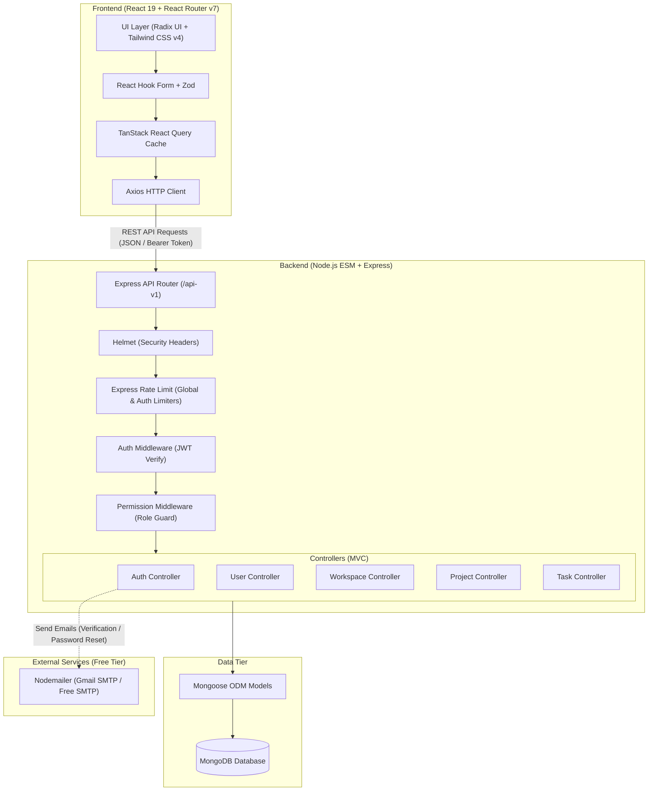

# TaskHub — Project Manager

A modern, full-stack collaborative project management platform designed for teams, workspaces, and task tracking. TaskHub provides workspace organization, granular role-based permissions, customizable project workflows, task assignment, subtasks, activity audits, and real-time dashboard analytics.

---

## Architecture Diagram



---

## Features

- **Workspaces & Collaboration**: Create workspaces, invite teammates via email tokens or invite links, and assign workspace roles (`Admin`, `Member`, `Viewer`).
- **Project Tracking**: Organize work into projects with dates, statuses, and assigned project members.
- **Task Management**: Create tasks with priorities (`Low`, `Medium`, `High`), statuses (`To Do`, `In Progress`, `Review`, `Done`), assignees, watchers, and due dates.
- **Subtasks & Comments**: Break complex tasks into subtasks and engage in threaded task-level discussions.
- **Activity Logs**: Automatic audit trail for task creation, status updates, priority adjustments, description edits, and member assignments.
- **Dashboard & Analytics**: Real-time project health statistics and progress charts using Recharts.
- **Secure Authentication**: Email-based signup with verification tokens, password reset flows, bcrypt password hashing, and JWT session handling.

---

## Tech Stack

The technology stack is extracted directly from project dependencies:

### Backend (`backend/package.json`)
- **Runtime & Architecture**: Node.js (ESM, `"type": "module"`)
- **Framework**: Express (`^4.22.1`)
- **Database & ODM**: MongoDB (`^7.1.0`), Mongoose (`^9.1.5`)
- **Authentication & Security**:
  - `bcrypt` (`^6.0.0`)
  - `jsonwebtoken` (`^9.0.3`)
  - `cors` (`^2.8.6`)
  - `helmet` (`^8.0.0`)
  - `express-rate-limit` (`^7.5.0`)
- **Validation**:
  - `zod` (`^3.25.76`)
  - `zod-express-middleware` (`^1.4.0`)
- **Email Service**: `nodemailer` (`^6.10.0`) via free SMTP (Gmail App Password / Resend)
- **Utilities & Logging**: `winston` (`^3.17.0`), `morgan` (`^1.10.1`), `dotenv` (`^17.2.3`)
- **Development**: `nodemon` (`^3.1.11`)

### Frontend (`frontend/package.json`)
- **Core Framework**: React (`^19.2.4`), React DOM (`^19.2.4`)
- **Routing & Framework Engine**:
  - `react-router` (`7.12.0`)
  - `@react-router/node` (`7.12.0`)
  - `@react-router/serve` (`7.12.0`)
  - `@react-router/dev` (`7.12.0`)
- **Build System**: Vite (`^7.1.7`), TypeScript (`5.4`), `vite-tsconfig-paths` (`^5.1.4`)
- **Styling & Design System**:
  - `tailwindcss` (`^4.1.13`)
  - `@tailwindcss/vite` (`^4.1.13`)
  - `tw-animate-css` (`^1.4.0`)
  - `tailwind-merge` (`^3.4.0`)
  - `clsx` (`^2.1.1`)
  - `class-variance-authority` (`^0.7.1`)
- **UI Components & Icons**:
  - `radix-ui` (`^1.4.3`)
  - `@radix-ui/react-avatar` (`^1.1.11`)
  - `@radix-ui/react-label` (`^2.1.8`)
  - `@radix-ui/react-slot` (`^1.2.4`)
  - `lucide-react` (`^1.8.0`)
  - `react-day-picker` (`^9.14.0`)
- **Data Fetching & State**: `@tanstack/react-query` (`^5.90.21`), `axios` (`^1.13.5`)
- **Forms & Validation**: `react-hook-form` (`^7.71.1`), `@hookform/resolvers` (`^5.2.2`), `zod` (`^4.3.6`)
- **Data Visualization**: `recharts` (`^3.8.0`)
- **Notifications**: `sonner` (`^2.0.7`), `sonne` (`^0.0.0`)
- **Utilities**: `date-fns` (`^4.1.0`), `isbot` (`^5.1.31`)

---

## Folder Structure

```
project-manager/
├── .gitignore                    # Root repository gitignore
├── README.md                     # Project documentation
├── backend/                      # Express.js REST API
│   ├── config/                   # Database & application configurations
│   ├── controllers/              # Business logic (auth, workspace, project, task, user)
│   ├── libs/                     # Utilities (email sender, schema validators)
│   ├── middleware/               # Auth, rate limiting, permissions, and error handling
│   ├── models/                   # Mongoose schemas (User, Workspace, Project, Task, etc.)
│   ├── routes/                   # Express route definitions
│   ├── src/                      # Modular architecture (config, libs, middleware, utils)
│   ├── index.js                  # Express entry point
│   ├── package.json              # Backend dependencies and scripts
│   └── vercel.json               # Backend deployment configuration
└── frontend/                     # React 19 + React Router v7 application
    ├── app/
    │   ├── components/           # UI components (Radix primitives, dashboard, tasks, workspaces)
    │   ├── hooks/                # Custom React query hooks (auth, project, task, workspace)
    │   ├── lib/                  # Axios instance, schema definitions, utility functions
    │   ├── provider/             # Context providers (AuthContext, ReactQueryProvider)
    │   ├── routes/               # Route components (auth, dashboard, projects, tasks)
    │   ├── app.css               # Global styling and Tailwind tokens
    │   ├── root.tsx              # Root HTML layout and error boundaries
    │   └── routes.ts             # React Router v7 route tree
    ├── public/                   # Static assets
    ├── package.json              # Frontend dependencies and scripts
    ├── react-router.config.ts    # React Router framework configuration
    ├── tsconfig.json             # TypeScript configuration
    └── vite.config.ts            # Vite bundler configuration
```

---

## Prerequisites

Before running the application locally, ensure you have:
- **Node.js**: v20.x or higher
- **npm** (or compatible package manager such as pnpm or yarn)
- **MongoDB**: A running local MongoDB instance or a cloud MongoDB Atlas connection URI

---

## Environment Variables

> **Note:** Never commit real secrets or credentials to source control. Create `.env` files locally based on the variable names below.

### Backend (`backend/.env`)

| Variable | Description |
|---|---|
| `PORT` | Port number the backend server listens on (e.g. `5000`) |
| `NODE_ENV` | Environment mode (`development` \| `production` \| `test`) |
| `MONGODB_URI` | MongoDB connection string |
| `JWT_SECRET` | Secret key used for signing and verifying JWT tokens |
| `FRONTEND_URL` | Base URL of the client app (for CORS, verification & reset links) |
| `SMTP_HOST` | SMTP server host (e.g. `smtp.gmail.com`) |
| `SMTP_PORT` | SMTP port (e.g. `587` for TLS or `465` for SSL) |
| `SMTP_USER` | SMTP username / email address |
| `SMTP_PASS` | SMTP password (e.g. 16-character Google App Password) |
| `FROM_EMAIL` | Sender email address displayed to recipients |

### Frontend (`frontend/.env`)

| Variable | Description |
|---|---|
| `VITE_API_URL` | Base URL pointing to the backend API (defaults to `http://localhost:5000/api-v1`) |

---

## Setup Steps

### 1. Backend Setup

1. Open your terminal and navigate to the backend directory:
   ```bash
   cd backend
   ```
2. Install dependencies:
   ```bash
   npm install
   ```
3. Create a `.env` file in `backend/` and configure the environment variables:
   ```bash
   PORT=5000
   NODE_ENV=development
   MONGODB_URI=mongodb://localhost:27017/project-manager
   JWT_SECRET=your_jwt_secret_key_here
   FRONTEND_URL=http://localhost:5173
   SMTP_HOST=smtp.gmail.com
   SMTP_PORT=587
   SMTP_USER=your_email@gmail.com
   SMTP_PASS=your_16_char_google_app_password
   FROM_EMAIL=your_email@gmail.com
   ```
4. Start the backend development server:
   ```bash
   npm run dev
   ```
   The backend API will be accessible at `http://localhost:5000`.

---

### 2. Frontend Setup

1. Open a new terminal tab and navigate to the frontend directory:
   ```bash
   cd frontend
   ```
2. Install dependencies:
   ```bash
   npm install
   ```
3. Create a `.env` file in `frontend/` (optional if using defaults):
   ```bash
   VITE_API_URL=http://localhost:5000/api-v1
   ```
4. Start the frontend development server:
   ```bash
   npm run dev
   ```
   The frontend application will be accessible at `http://localhost:5173`.

---

## Available NPM Scripts

### Backend (`backend/`)
- `npm run dev` — Starts the Express API server with `nodemon` for auto-reloading during development.
- `npm start` — Runs the production Node.js server (`node index.js`).
- `npm test` — Test runner script placeholder.

### Frontend (`frontend/`)
- `npm run dev` — Starts the React Router / Vite local development server.
- `npm run build` — Compiles and builds the production bundle via `react-router build`.
- `npm start` — Serves the compiled production build with `@react-router/serve`.
- `npm run typecheck` — Generates React Router types (`react-router typegen`) and runs TypeScript type checking (`tsc`).
